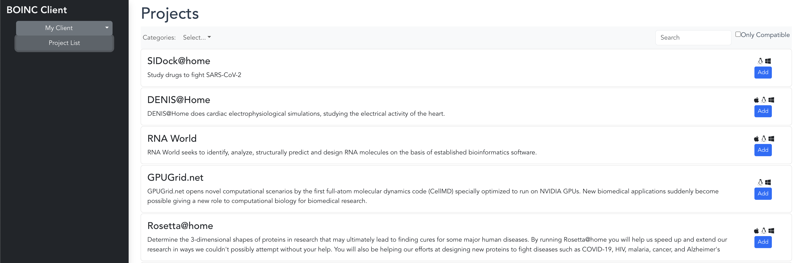

# BOINC Web UI

A simple Web UI for managing multiple BOINC clients. This is born from wanting to use the basic BOINC client docker image to execute work items, but not have a desktop application to manage them.

## Introdution

This project intends to make it simple and inviting to connect all of your BOINC clients in one simple web-based dashboard

## Features

* Supports multiple clients
* Allows registering a client to a new project
* Overview of the currently attached projects and the work items

#### Roadmap

* Manage a project's state (pause, resume, disconnect)
* Message list
* Client Preferences
* Account Manager

## See it in action

_Add a new client_

_See the client's state_

_View, search and join projects_

